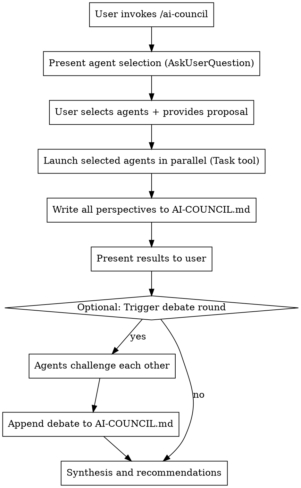

# AI Council

Summon a council of specialized AI advisors to deliberate on your ideas, proposals, or decisions from multiple perspectives.

## Overview

The AI Council launches parallel sub-agents, each with a distinct analytical lens. Council members analyze independently, document their reasoning to a persistent file, then you can optionally have them debate to surface the strongest arguments.

## How It Works



## Invocation Protocol

When this skill is invoked:

### Step 1: Agent Selection

Use `AskUserQuestion` with multi-select to let the user choose which council members to summon:

```
AskUserQuestion:
  question: "Which council members should deliberate on this?"
  header: "Council"
  multiSelect: true
  options:
    - label: "Optimist Strategist"
      description: "Explores best-case scenarios and success pathways"
    - label: "Devil's Advocate"
      description: "Stress-tests assumptions and surfaces hidden risks"
    - label: "Neutral Analyst"
      description: "Provides objective synthesis and trade-off analysis"
    - label: "Technical Validator"
      description: "Assesses engineering feasibility and implementation reality"
    - label: "Legal Domain Expert"
      description: "Analyzes legal risks, regulatory requirements, and compliance"
    - label: "User Advocate"
      description: "Champions user needs, identifies friction, validates UX"
    - label: "Growth Strategist"
      description: "Examines viral loops, acquisition channels, and scaling"
```

### Step 2: Gather the Proposal

If not already provided, ask the user for:
- **Proposal**: What idea/decision needs analysis?
- **Context**: Relevant background, constraints, goals
- **Key Questions**: Specific aspects to focus on (optional)

### Step 3: Launch Agents in Parallel

For each selected agent, use the `Task` tool to launch a sub-agent with:
- The agent's system prompt from their definition file (bundled in `agents/` subdirectory)
- The user's proposal and context
- Instructions to provide perspective-aligned analysis

**Critical**: Launch ALL selected agents in a single message with multiple Task tool calls for true parallel execution.

Example Task invocation pattern:
```
Task:
  subagent_type: general-purpose
  model: opus
  description: "[Agent Name] council analysis"
  prompt: |
    You are the [Agent Name]. [Insert agent system prompt here]

    **Proposal to Analyze:**
    [User's proposal]

    **Context:**
    [User's context]

    **Your Task:**
    Provide your perspective-aligned analysis following your output structure.
    Be specific and actionable. Include confidence levels for key claims.
```

**Always use `model: opus`** for council agents to ensure the highest quality analysis.

### Step 4: Write Deliberation Log

**IMPORTANT**: After collecting all agent responses, write them to `AI-COUNCIL.md` in the current working directory.

Use the following format:

```markdown
# AI Council Deliberation

**Date**: [ISO timestamp]
**Proposal**: [Brief title or summary]

---

## Proposal Under Review

[Full proposal text and context provided by user]

**Key Questions**:
1. [Question 1]
2. [Question 2]
...

---

## Council Perspectives

### Optimist Strategist

[Full analysis from this agent]

**Confidence Level**: [X]%

---

### Devil's Advocate

[Full analysis from this agent]

**Confidence Level**: [X]%

---

[Continue for each selected agent...]

---

## Areas of Agreement

- [Point where multiple agents agree]
- [Another consensus point]

## Areas of Disagreement

- [Contested claim]: [Agent A] says X, [Agent B] says Y

---

## Debate Round (if conducted)

### [Agent Name] challenges [Other Agent]

> "[Specific claim being challenged]"

[Challenge and counter-argument]

[Continue for all challenges...]

---

## Synthesis

### Consensus
[Where all/most agents agree]

### Key Risks
[Top concerns across all perspectives]

### Key Opportunities
[Top upsides identified]

### Recommended Next Steps
1. [Action item]
2. [Action item]
...

---

*Council session complete.*
```

### Step 5: Present Results

After writing to `AI-COUNCIL.md`, present a summary to the user:
- Highlight areas of agreement across agents
- Flag areas of disagreement for potential debate
- Mention that full deliberation is saved to `AI-COUNCIL.md`

### Step 6: Optional Debate Round

Ask if the user wants agents to challenge each other:
```
AskUserQuestion:
  question: "Should the council debate their positions?"
  header: "Debate"
  options:
    - label: "Yes, have them challenge each other"
      description: "Agents will directly confront opposing claims"
    - label: "No, proceed to synthesis"
      description: "Skip to final recommendations"
```

If debate requested:
1. Launch a second round where each agent challenges specific claims from others
2. **Append** the debate results to `AI-COUNCIL.md` (don't overwrite)
3. Update the synthesis section

### Step 7: Final Synthesis

Provide a unified summary and ensure `AI-COUNCIL.md` contains:
- **Consensus**: Where all/most agents agree
- **Contested**: Where significant disagreement exists
- **Key Risks**: Top concerns across all perspectives
- **Key Opportunities**: Top upsides identified
- **Recommended Next Steps**: Actionable path forward

## Bundled Agents

This skill includes 7 council members in the `agents/` subdirectory:

| Agent | File | Role |
|-------|------|------|
| Optimist Strategist | `agents/optimist-strategist.md` | Best-case scenarios, success pathways |
| Devil's Advocate | `agents/devils-advocate.md` | Risk identification, assumption stress-testing |
| Neutral Analyst | `agents/neutral-analyst.md` | Evidence synthesis, trade-off mapping |
| Technical Validator | `agents/technical-validator.md` | Feasibility assessment, implementation reality |
| Legal Domain Expert | `agents/legal-domain-expert.md` | Legal risk, regulatory compliance, IP & ToS analysis |
| User Advocate | `agents/user-advocate.md` | User experience, needs validation, friction identification |
| Growth Strategist | `agents/growth-strategist.md` | Viral loops, acquisition channels, retention mechanics |

All agents use `model: opus` for highest quality analysis.

## Quick Reference

| Trigger | Action |
|---------|--------|
| `/ai-council` | Launch council with agent selection |
| "Agents gather" | Alternative trigger phrase |
| "Make them debate" | Trigger debate round after initial analysis |
| "Synthesize" | Request unified summary from Neutral Analyst |

## Output Files

| File | Purpose |
|------|---------|
| `AI-COUNCIL.md` | Complete deliberation log with all perspectives, debates, and synthesis |

## Common Patterns

### Full Council
Select all agents for comprehensive analysis of major decisions.

### Technical Review
Select: Technical Validator + Devil's Advocate + Neutral Analyst

### Strategic Review
Select: Optimist Strategist + Growth Strategist + Devil's Advocate

### Quick Feasibility
Select: Technical Validator + Neutral Analyst

## Example Invocation

User: `/ai-council`

Claude presents agent selection, user selects all agents and provides:
> "We're considering building an AI-powered code review tool that integrates with GitHub. Target market is enterprise teams. Budget is $200K for MVP."

Claude:
1. Launches 7 parallel Task agents (all using Opus)
2. Collects all responses
3. Writes complete deliberation to `AI-COUNCIL.md`
4. Presents summary to user
5. Offers debate option
6. If debate requested, appends debate to file
7. Finalizes synthesis in file and presents recommendations
