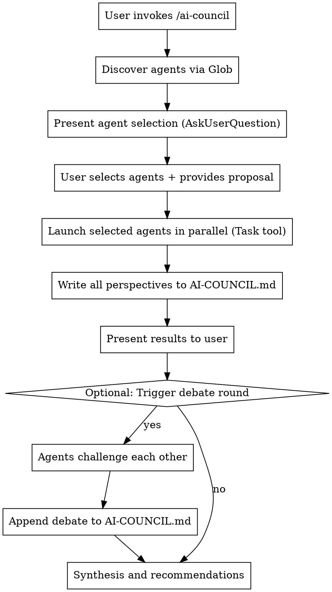

# AI Council

Summon a council of specialized AI advisors to deliberate on your ideas, proposals, or decisions from multiple perspectives.

## Overview

The AI Council launches parallel sub-agents, each with a distinct analytical lens. Council members analyze independently, document their reasoning to a persistent file, then you can optionally have them debate to surface the strongest arguments.

## How It Works



## Invocation Protocol

When this skill is invoked:

### Step 1: Discover and Select Agents

1. Use the `Glob` tool with pattern `agents/*.md` (relative to the plugin root) to discover all available agent files.
2. Read each discovered file to extract the YAML frontmatter fields: `name`, `description`, `model`, and `color`.
3. Build `AskUserQuestion` options dynamically from the discovered agents. For each agent:
   - `label`: Convert the `name` field from kebab-case to Title Case (e.g., `devils-advocate` → `Devil's Advocate`)
   - `description`: Use a short summary extracted from the first sentence of the `description` field
4. Present the multi-select agent chooser:

```
AskUserQuestion:
  question: "Which council members should deliberate on this?"
  header: "Council"
  multiSelect: true
  options:
    [dynamically built from discovered agents]
```

### Step 2: Gather the Proposal

If not already provided, ask the user for:
- **Proposal**: What idea/decision needs analysis?
- **Context**: Relevant background, constraints, goals
- **Key Questions**: Specific aspects to focus on (optional)

### Step 3: Launch Agents in Parallel

For each selected agent:

1. Read the agent `.md` file from the `agents/` directory.
2. Extract the `model` from frontmatter (default to `opus` if not specified).
3. Use the file body (everything after the frontmatter closing `---`) as the agent's system prompt.
4. Launch via the `Task` tool.

**Critical**: Launch ALL selected agents in a single message with multiple Task tool calls for true parallel execution.

Example Task invocation pattern:
```
Task:
  subagent_type: general-purpose
  model: [from agent frontmatter, default opus]
  description: "[Agent Name] council analysis"
  prompt: |
    You are the [Agent Name]. [Insert agent system prompt body here]

    **Proposal to Analyze:**
    [User's proposal]

    **Context:**
    [User's context]

    **Your Task:**
    Provide your perspective-aligned analysis following your output structure.
    Be specific and actionable. Include confidence levels for key claims.
```

**Always use the model specified in the agent's frontmatter** (defaulting to `opus`) for council agents to ensure the highest quality analysis.

### Step 4: Write Deliberation Log

**IMPORTANT**: After collecting all agent responses, write them to `AI-COUNCIL.md` in the current working directory.

Use the following format:

```markdown
# AI Council Deliberation

**Date**: [ISO timestamp]
**Proposal**: [Brief title or summary]

---

## Proposal Under Review

[Full proposal text and context provided by user]

**Key Questions**:
1. [Question 1]
2. [Question 2]
...

---

## Council Perspectives

### [Agent Name]

[Full analysis from this agent]

**Confidence Level**: [X]%

---

[Continue for each selected agent...]

---

## Areas of Agreement

- [Point where multiple agents agree]
- [Another consensus point]

## Areas of Disagreement

- [Contested claim]: [Agent A] says X, [Agent B] says Y

---

## Debate Round (if conducted)

### [Agent Name] challenges [Other Agent]

> "[Specific claim being challenged]"

[Challenge and counter-argument]

[Continue for all challenges...]

---

## Synthesis

### Consensus
[Where all/most agents agree]

### Key Risks
[Top concerns across all perspectives]

### Key Opportunities
[Top upsides identified]

### Recommended Next Steps
1. [Action item]
2. [Action item]
...

---

*Council session complete.*
```

### Step 5: Present Results

After writing to `AI-COUNCIL.md`, present a summary to the user:
- Highlight areas of agreement across agents
- Flag areas of disagreement for potential debate
- Mention that full deliberation is saved to `AI-COUNCIL.md`

### Step 6: Optional Debate Round

Ask if the user wants agents to challenge each other:
```
AskUserQuestion:
  question: "Should the council debate their positions?"
  header: "Debate"
  options:
    - label: "Yes, have them challenge each other"
      description: "Agents will directly confront opposing claims"
    - label: "No, proceed to synthesis"
      description: "Skip to final recommendations"
```

If debate requested:
1. Launch a second round where each agent challenges specific claims from others
2. **Append** the debate results to `AI-COUNCIL.md` (don't overwrite)
3. Update the synthesis section

### Step 7: Final Synthesis

Provide a unified summary and ensure `AI-COUNCIL.md` contains:
- **Consensus**: Where all/most agents agree
- **Contested**: Where significant disagreement exists
- **Key Risks**: Top concerns across all perspectives
- **Key Opportunities**: Top upsides identified
- **Recommended Next Steps**: Actionable path forward

## Extensibility

The council automatically discovers all agent files in the `agents/` directory. To add a new agent, either:

- Use `/create-agent` to generate one from a natural language description
- Manually create an `.md` file in `agents/` following the established frontmatter + system prompt pattern

New agents are immediately available the next time `/ai-council` is invoked — no registration step required.

## Quick Reference

| Trigger | Action |
|---------|--------|
| `/ai-council` | Launch council with agent selection |
| "Agents gather" | Alternative trigger phrase |
| "Make them debate" | Trigger debate round after initial analysis |
| "Synthesize" | Request unified summary from Neutral Analyst |

## Output Files

| File | Purpose |
|------|---------|
| `AI-COUNCIL.md` | Complete deliberation log with all perspectives, debates, and synthesis |

## Common Patterns

### Full Council
Select all agents for comprehensive analysis of major decisions.

### Technical Review
Select: Technical Validator + Devil's Advocate + Neutral Analyst

### Strategic Review
Select: Optimist Strategist + Growth Strategist + Devil's Advocate

### Quick Feasibility
Select: Technical Validator + Neutral Analyst

## Example Invocation

User: `/ai-council`

Claude:
1. Discovers all agents in `agents/` via Glob
2. Presents dynamic multi-select with discovered agents
3. User selects agents and provides proposal
4. Launches parallel Task agents (each using their configured model)
5. Collects all responses
6. Writes complete deliberation to `AI-COUNCIL.md`
7. Presents summary to user
8. Offers debate option
9. If debate requested, appends debate to file
10. Finalizes synthesis in file and presents recommendations
